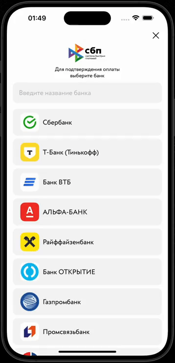

# SBP
Swift package for service SBP (СБП), more details about SBP you can find [here](https://sbp.nspk.ru).

## Quick Start

### with UIKit

you may define smth like this:

```swift
import SwiftUI
import SBP

@available(iOS 13.0, *)
final class SBPay {
    
  func chooseBank(on viewController: UIViewController,
                    presentationStyle: UIModalPresentationStyle = .fullScreen,
                    completion: @escaping (String) -> (),
                    onClose: @escaping () -> ()) {
        
        let vc = UIHostingController(rootView: BanksViewConnector() {
            print($0)
            completion($0)
            viewController.presentedViewController?.dismiss(animated: true)
        } onCloseTap: {
            onClose()
            viewController.presentedViewController?.dismiss(animated: true)
        })
        vc.modalPresentationStyle = presentationStyle
        viewController.present(vc, animated: true)
    }
}


class ViewController: UIViewController {
  
  override func viewDidLoad() {
    super.viewDidLoad()
  }
  
  override func viewDidAppear(_ animated: Bool) {
    super.viewDidAppear(animated)
    
    SBPay().chooseBank(on: self) {
      print($0)
    }
  }
}
```

also you need add <b>LSApplicationQueriesSchemes</b> key into you project <b>info.plst</b> 

```plst
 <key>LSApplicationQueriesSchemes</key>
  <array>
    <string>bank100000000000</string>
    <string>bank100000000001</string>
    ...
    <string>bank100000000999</string>
    <string>bank100000001000</string>
  </array>
```

<b>Warning!</b> Starting with iOS 15 there's limit in maximum 50 entries in list, so you probably need to take first 50 entries from [c2bmembers.json](https://qr.nspk.ru/proxyapp/c2bmembers.json). Look for details [here](https://developer.apple.com/documentation/uikit/uiapplication/1622952-canopenurl#discussion).

That's need for ```UIApplication.shared.canOpenURL``` method worked correctly.
You can copy and paste all lines from example

### Different cases

Based on the infomartion above service is trying to find installed apps and then module opens screen with the list of bank apps:

  <p align="left">
  
  </p>
  
  Otherwise the service offers to choose the bank connected to SBP from the list:
  
  <p align="left">
  
  </p>
  

